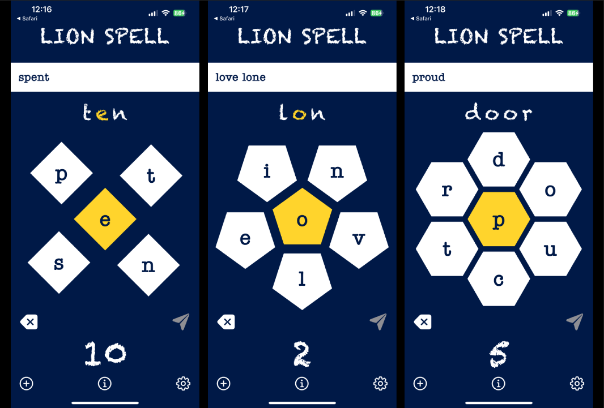
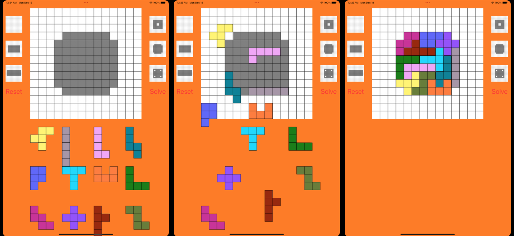
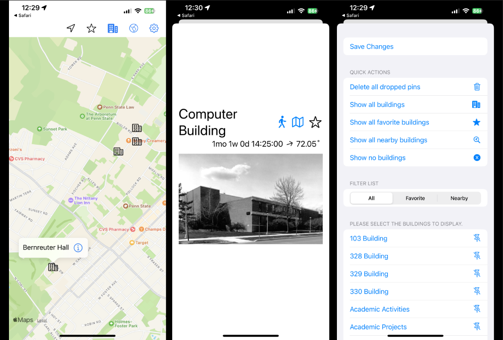
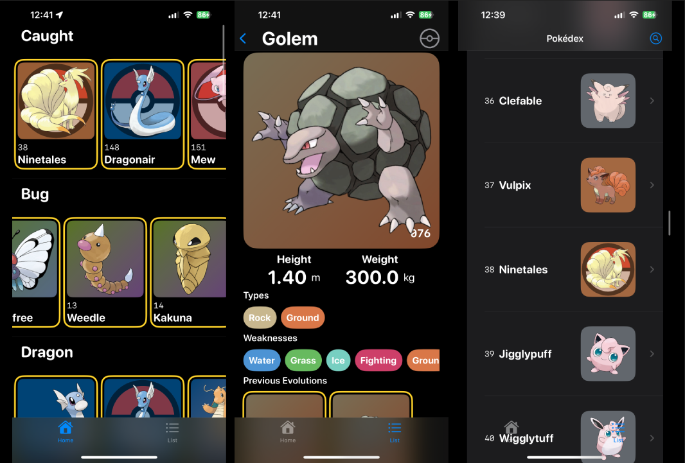
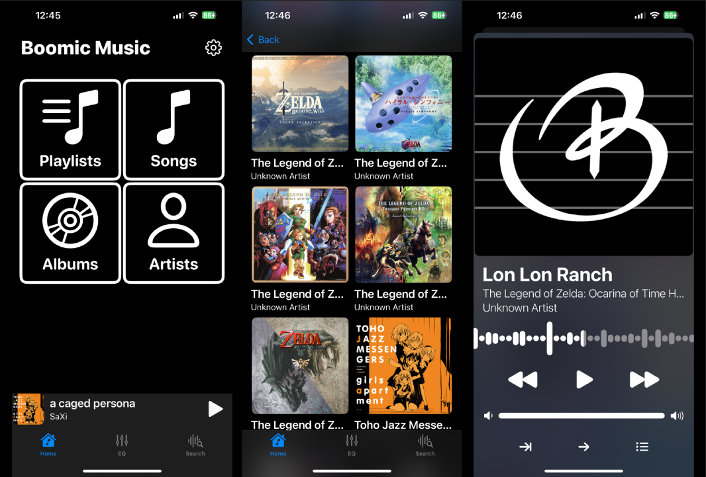

# iOS Apps

This repository contains all of the projects I did for the app development class I took in the Fall 2022 semester. Each project is contained in its own folder. The Workflow project was just a test run of the class development and submission procedures. 

## Lion Spell
How good is your vocabulary? Lion spell is a game where players are presented with 5-7 letters, and they have to spell as many words as possible. However, all words must contain the central, golden letter.  Points are awarded depending on the length of the word, with bonus points for using each letter! Players can also double-check how many words are possible and try and solve them all.

Examples of 5, 6, and 7 letter games. 

## Pentominoes
Can you solve all five? Pentominoes is an iPad game where players have to fit all the shapes into a certain area. 

Examples of the start of a game, the middle of a game, and a solved game. Care was taken to ensure pieces always snap onto positions on the grid. 

## Campus
The Campus app is your guide to everything on Campus!\* Pin important locations such as your dorm, classrooms, dining halls, etc. on the map and have instant walking times and directions in your pocket at all times.

Examples of buildings marked on the map, a building showcase with walking time (looks like it is only 5 weeks from Sacramento to State College!), and the filtering settings.

\**assuming you go to Penn State University Park campus.* 

## Pokédex
Can you catch 'em all? Track the original 151 Pokémon on your phone! Users can track which Pokémon they've caught, as well as check their evolutions and always know the weak types of Pokémon they battle against.

Examples of the home screen, where cards are laid out by type, a Pokémon summary, and the list laid out in the order of the original Pokédex.

## Boomic Music
Drag and drop your high resolution library and take it wherever you go! You can learn more about Boomic in its repository [here](https://github.com/kevink2022/Boomic). The version is this repo was what was developed for my final project submission in the final 5 weeks of class. 

Examples of the home screen, album select screen, and the currently playing song with the waveform time slider.